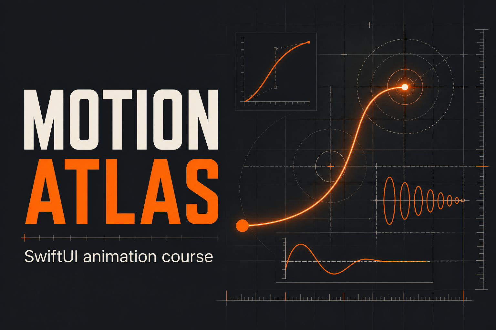

# Motion Atlas

Motion Atlas is a free, beginner-first course for learning purposeful,
accessible iOS animation with SwiftUI. It starts before syntax, then combines
plain-language lessons, live motion labs, retrieval practice, spaced review,
and production checks.

**[Open the live course](https://motion-atlas-swiftui-course.saksham-virmani.chatgpt.site)**



## What is included

- 48 core iOS and SwiftUI lessons, from absolute beginner concepts to shipping.
- Eight optional web-motion lessons kept separate from iOS completion.
- Stable, shareable lesson URLs generated from one typed course registry.
- Live labs with saved controls and an explicit Reduce Motion simulation.
- Search, bookmarks, honest completion state, mastery stages, and spaced review.
- Guest-first progress stored on the device.
- Optional Sign in with ChatGPT and Cloudflare D1 account sync on OpenAI Sites.
- Export and deletion controls for account-linked learning data.
- An explicit source policy: external work is reference-only unless exact reuse
  permission and attribution are recorded.

The current 56 lessons form a real, usable foundation. The deeper lesson-by-
lesson rebuild, Swift compile matrix, and real two-device account proof remain
tracked work rather than hidden behind a “finished” claim. See
[`docs/STATUS.md`](docs/STATUS.md).

## Run locally

Requires Node.js `>=22.13.0`.

```bash
npm install
npm run dev
```

Open `http://localhost:3000`.

The public learning path works without an account. Sites identity headers and
the production D1 binding are available only in the hosted environment; local
requests therefore behave as a guest unless you deliberately provide a test
environment.

## Verify a change

```bash
npm run lint
npm run typecheck
npm test
npm audit --omit=dev
```

`npm test` creates a production worker and checks product content, native
routes, progress validation and merging, the D1 schema, privacy, and licensing
artifacts.

After changing `db/schema.ts`, generate and inspect a migration:

```bash
npm run db:generate
```

## Architecture

- `content/course.json`: canonical structured course records.
- `content/course.ts`: runtime validation and typed accessors.
- `app/learn/`: searchable course library and stable lesson routes.
- `app/review/`: transparent spaced-retrieval queue.
- `app/components/learning/`: local-first guest and account sync client.
- `db/`, `drizzle/`, and `lib/progress-store.ts`: D1 learning persistence.
- `public/motion-atlas-course.html`: temporary compatibility and migration
  source while native-route parity is verified.
- `docs/MASTER_PLAN.md`: durable product plan.
- `docs/CONTENT_STANDARD.md`: publication gate for every lesson.
- `docs/SOURCE_POLICY.md` and `docs/SOURCE_LEDGER.md`: originality and reuse
  controls.

The standalone course is not a second editable source. New product work should
flow through the typed registry and native routes.

## Identity and learner data

- No account is required to learn.
- Sign in with ChatGPT is optional and handled by the Sites platform.
- Server writes derive ownership from trusted Sites identity headers, never a
  client-supplied user ID.
- Account storage contains learning state, not passwords, payment data, public
  profiles, or free-form private notes.
- Guest import merges completed work instead of replacing it.
- Learners can export or permanently delete their Motion Atlas progress.

The mastery labels are transparent self-assessment and practice signals, not a
certificate or server-verified credential.

## Contributing

Issues and focused pull requests are welcome. Read
[`CONTRIBUTING.md`](CONTRIBUTING.md) before changing lessons, examples, or
visuals. In particular, do not paste tutorial prose, code, screenshots, or
animation assets from another source merely because they are publicly visible.

## License

- Original software and code samples: [MIT](LICENSE).
- Original non-code course content: [CC BY 4.0](CONTENT_LICENSE.md).
- Third-party names, linked material, dependencies, and any ledgered external
  work remain under their own terms and are excluded from those grants.

Made by [Saksham Virmani](https://sakshamvirmani.com).
